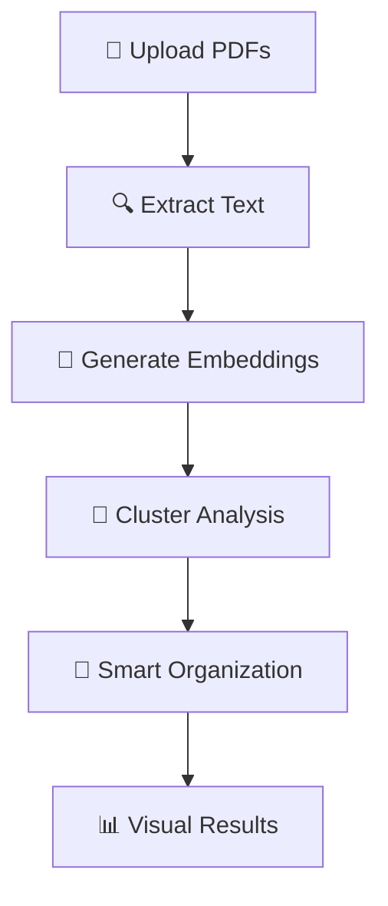

# 🤖 AI-Powered PDF Organizer

> **Intelligent document management system that automatically analyzes, understands, and organizes PDF documents by semantic similarity using state-of-the-art AI.**

## 🚀 Quick Start

```bash
# 1. Install dependencies
pip install -r requirements.txt

# 2. Run the web app
python -m streamlit run app.py

# 3. Upload PDFs and let AI organize them!
```

**🎯 Perfect for**: Research papers, legal documents, reports, invoices, mixed document collections

---

## ✨ Key Features

| Feature                      | Description                                              | Benefit                                |
| ---------------------------- | -------------------------------------------------------- | -------------------------------------- |
| 🧠 **AI-Powered Clustering** | Advanced semantic analysis using BERT embeddings         | Groups similar documents automatically |
| 🌍 **100+ Languages**        | Multilingual support including Arabic, Chinese, Japanese | Works with international documents     |
| 💾 **Hybrid Processing**     | Local models (reliable) + API fallback                   | Best of both worlds                    |
| 🌐 **Modern Web UI**         | Clean Streamlit interface with real-time progress        | User-friendly experience               |
| 📊 **Smart Visualizations**  | Interactive charts and cluster analysis                  | Understand your document patterns      |
| ⚡ **Fast & Cached**         | Smart caching for instant reprocessing                   | Efficient performance                  |

---

## 📱 Available AI Models

| Model                                     | Type     | Rating     | Size   | Languages      | Best For                            |
| ----------------------------------------- | -------- | ---------- | ------ | -------------- | ----------------------------------- |
| **all-MiniLM-L6-v2**                      | 💾 Local | ⭐⭐⭐⭐⭐ | 80MB   | English        | **🥇 RECOMMENDED** - Fast, reliable |
| **paraphrase-multilingual-MiniLM-L12-v2** | 💾 Local | ⭐⭐⭐⭐   | 420MB  | 50+ languages  | **🌍 Multilingual default**         |
| **BAAI/bge-m3**                           | 💾 Local | ⭐⭐⭐⭐⭐ | 2.27GB | 100+ languages | **🏆 Highest quality**              |
| **all-mpnet-base-v2**                     | 💾 Local | ⭐⭐⭐⭐   | 420MB  | English        | High accuracy English               |
| **intfloat/multilingual-e5-large**        | 💾 Local | ⭐⭐⭐⭐⭐ | 2.24GB | 100+ languages | Maximum accuracy                    |

💡 **Model Selection Guide:**

- **🥇 Most users**: `all-MiniLM-L6-v2` (80MB) - Perfect balance
- **🌍 Multilingual**: `paraphrase-multilingual-MiniLM-L12-v2` (420MB)
- **🏆 Best quality**: `BAAI/bge-m3` (2.27GB) - State-of-the-art

---

## 🛠️ Installation & Setup

### Prerequisites

- Python 3.8+
- 4GB RAM (8GB recommended for large models)

### Install

```bash
# Clone repository
git clone https://github.com/AmenKaabachi/pdf_organizer.git
cd pdf_organizer

# Install dependencies
pip install -r requirements.txt

# Optional: For local models (recommended)
pip install sentence-transformers torch
```

### Run

```bash
# Web Interface (Recommended)
python -m streamlit run app.py

# Command Line Interface
python main.py --input-dir ./data --output-dir ./output

# See all available models
python main.py --list-models
```

---

## 📊 How It Works



1. **📄 PDF Processing**: Extracts text and metadata from documents
2. **🧠 AI Analysis**: Generates semantic embeddings using transformer models
3. **🎯 Smart Clustering**: Groups similar documents using ML algorithms
4. **📁 Auto-Organization**: Creates folders and moves files intelligently
5. **📊 Visual Insights**: Shows cluster analysis and document relationships

---

## 🎯 Use Cases

| Scenario          | Documents                     | Benefit                      |
| ----------------- | ----------------------------- | ---------------------------- |
| **📚 Research**   | Academic papers, articles     | Auto-sort by topic/field     |
| **⚖️ Legal**      | Contracts, cases, briefs      | Organize by document type    |
| **🏢 Business**   | Reports, invoices, proposals  | Group by category/department |
| **🎓 Education**  | Assignments, resources, notes | Sort by subject/course       |
| **🏥 Healthcare** | Patient records, research     | Organize by specialty/type   |

---

## ⚙️ Configuration

### Model Selection (Web UI)

- Models show as: `💾 [Multi] ModelName (Size)` or `🌐 [EN] ModelName (FREE API)`
- **💾** = Local download (reliable, offline)
- **🌐** = API (requires internet)
- **[Multi]** = Multilingual, **[EN]** = English only

### CLI Options

```bash
python main.py --help
  --input-dir DIR       Input directory with PDFs
  --output-dir DIR      Output directory
  --model MODEL         AI model to use
  --algorithm ALGO      Clustering algorithm (kmeans, dbscan, agglomerative)
  --list-models         Show all available models
```

---

## 🔧 Technology Stack

**🤖 AI/ML**: sentence-transformers, scikit-learn, PyTorch  
**📄 PDF Processing**: PyMuPDF (fitz)  
**🌐 Web Interface**: Streamlit  
**📊 Visualization**: Plotly, matplotlib  
**⚡ Performance**: NumPy, pandas, caching

---

## 📚 Documentation

| Guide                                                | Purpose                                    |
| ---------------------------------------------------- | ------------------------------------------ |
| **[Hybrid Approach](docs/HYBRID_APPROACH.md)**       | ⭐ **Essential** - Current system overview |
| **[Deployment Guide](docs/DEPLOYMENT_GUIDE.md)**     | Production deployment options              |
| **[Multilingual Guide](docs/MULTILINGUAL_GUIDE.md)** | Working with multiple languages            |

---

## 🧪 Testing

```bash
# Run comprehensive test
python test_final.py

# Test specific model
python -c "from src.embeddings.embedding_generator import EmbeddingGenerator; g = EmbeddingGenerator(); print('✅ Working!')"
```

---

## 🤝 Contributing

1. Fork the repository
2. Create a feature branch: `git checkout -b feature-name`
3. Make changes and test: `python test_final.py`
4. Submit a pull request

---

## 📄 License

This project is licensed under the MIT License - see the [LICENSE](LICENSE) file for details.

---

## 🎉 Ready to Get Started?

```bash
streamlit run app.py
```

**Upload some PDFs and watch the AI organize them intelligently!** 🚀

---

<div align="center">

**Made with ❤️ using AI and Machine Learning**

[⭐ Star this repo](https://github.com/AmenKaabachi/pdf_organizer) • [🐛 Report Bug](https://github.com/AmenKaabachi/pdf_organizer/issues) • [💡 Request Feature](https://github.com/AmenKaabachi/pdf_organizer/issues)

</div>
