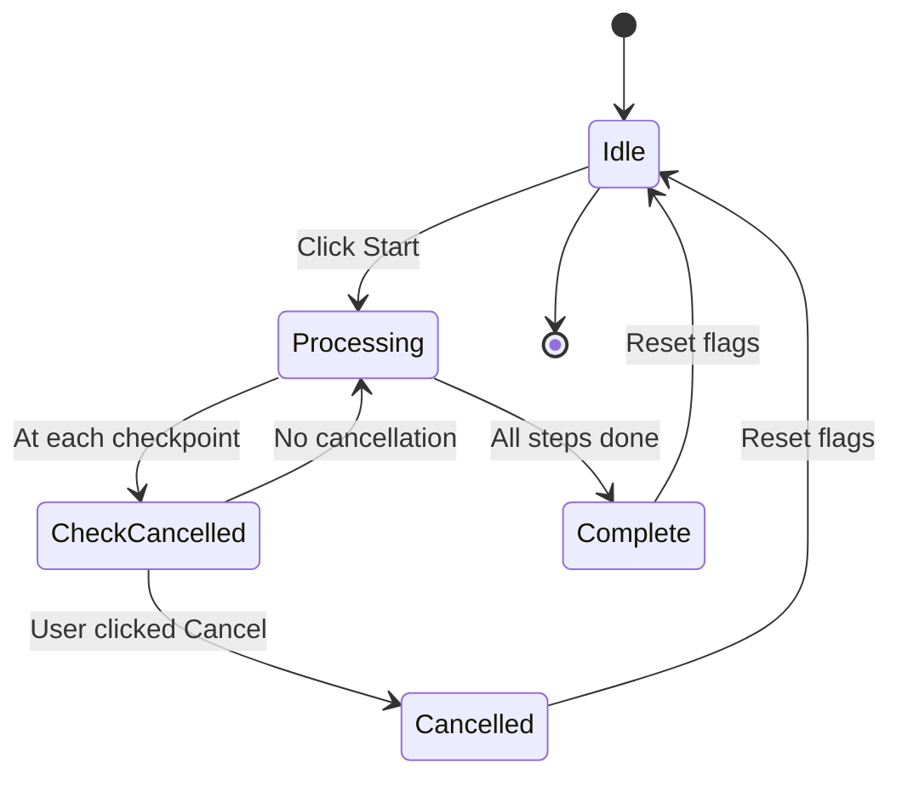

# 🛑 Cancel/Stop Processing Feature

## Overview

Users can now **cancel the processing** at any time during document analysis. This is useful when they want to:

- Change the embedding model
- Adjust clustering settings
- Stop a long-running process
- Fix incorrect file uploads

---

## 🎯 How It Works

### Visual Flow:

```
┌─────────────────────────────────────────────────────────┐
│  Upload Tab                                             │
├─────────────────────────────────────────────────────────┤
│                                                          │
│  ✅ 8 files uploaded                                     │
│                                                          │
│  ┌──────────────────────────────────────────┐           │
│  │ 📋 Uploaded Files                        │           │
│  │   - document1.pdf (245 KB)               │           │
│  │   - document2.pdf (189 KB)               │           │
│  └──────────────────────────────────────────┘           │
│                                                          │
│  ┌────────────┐  ┌─────────────────────────────┐        │
│  │ 🚀 Start   │  │                             │        │
│  │ Processing │  │                             │        │
│  └────────────┘  └─────────────────────────────┘        │
│                                                          │
└─────────────────────────────────────────────────────────┘

        ↓  (User clicks Start Processing)

┌─────────────────────────────────────────────────────────┐
│  Upload Tab                                             │
├─────────────────────────────────────────────────────────┤
│                                                          │
│  ✅ 8 files uploaded                                     │
│                                                          │
│  ┌──────────────────────────────────────────┐           │
│  │ 📄 Extracting text from PDFs...          │           │
│  │ ████████████░░░░░░░░░░░░░░░░░░ 50%       │           │
│  └──────────────────────────────────────────┘           │
│                                                          │
│  ┌────────────┐  ┌─────────────────────────────┐        │
│  │ 🛑 Cancel  │  │ ⏳ Processing in progress... │        │
│  │            │  │ Click Cancel to stop         │        │
│  └────────────┘  └─────────────────────────────┘        │
│                                                          │
└─────────────────────────────────────────────────────────┘

        ↓  (User clicks Cancel)

┌─────────────────────────────────────────────────────────┐
│  Upload Tab                                             │
├─────────────────────────────────────────────────────────┤
│                                                          │
│  ⚠️ Cancelling process...                               │
│  🛑 Processing cancelled after extraction                │
│                                                          │
│  ┌────────────┐  ┌─────────────────────────────┐        │
│  │ 🚀 Start   │  │ (User can now change         │        │
│  │ Processing │  │  model settings)             │        │
│  └────────────┘  └─────────────────────────────┘        │
│                                                          │
└─────────────────────────────────────────────────────────┘
```

---

## 🔧 Implementation Details

### Session State Variables

```python
st.session_state.processing = False           # Is processing currently running?
st.session_state.processing_cancelled = False # Did user click cancel?
```

### Button States

| State          | Button Shown        | Type             | Action                            |
| -------------- | ------------------- | ---------------- | --------------------------------- |
| **Idle**       | 🚀 Start Processing | Primary (Blue)   | Sets `processing=True` and starts |
| **Processing** | 🛑 Cancel           | Secondary (Gray) | Sets `processing_cancelled=True`  |
| **Cancelled**  | 🚀 Start Processing | Primary (Blue)   | Resets flags and ready to restart |

### Cancellation Checkpoints

The process can be cancelled at these stages:

1. ✅ **Before extraction** (immediate)
2. ✅ **After extraction, before embeddings** (~25% progress)
3. ✅ **After embeddings, before clustering** (~50% progress)
4. ✅ **After clustering, before naming** (~75% progress)

---

## 💡 Use Cases

### Scenario 1: Wrong Model Selected

```
User: "Oh no, I selected the English model but my docs are in Arabic!"
1. Click Cancel button
2. Change model to multilingual in sidebar
3. Click Start Processing again
```

### Scenario 2: Want More Clusters

```
User: "I want 5 clusters, not 3"
1. Click Cancel button
2. Adjust cluster slider in sidebar
3. Click Start Processing again
```

### Scenario 3: Long Download (First Time)

```
User: "Model downloading is taking too long, let me use a smaller one"
1. Click Cancel button (stops download)
2. Select smaller model (e.g., all-MiniLM-L6-v2)
3. Click Start Processing again
```

### Scenario 4: Uploaded Wrong Files

```
User: "Wait, I uploaded the wrong PDFs!"
1. Click Cancel button
2. Remove current files and upload correct ones
3. Click Start Processing again
```

---

## 🎨 UI/UX Features

### Visual Feedback

**Before Processing:**

```
┌────────────┐
│ 🚀 Start   │  <- Blue primary button
│ Processing │
└────────────┘
```

**During Processing:**

```
┌────────────┐  ┌───────────────────────────┐
│ 🛑 Cancel  │  │ ⏳ Processing in progress │  <- Info message
│            │  │ Click Cancel to stop      │
└────────────┘  └───────────────────────────┘
    ↑
Gray secondary button (less prominent)
```

**After Cancelling:**

```
⚠️ Cancelling process...
🛑 Processing cancelled after [stage name]

┌────────────┐
│ 🚀 Start   │  <- Button reappears
│ Processing │
└────────────┘
```

---

## 🔄 State Management Flow



---

## 🚨 Important Notes

1. **Partial Results Are Saved**

   - If cancelled after extraction, extracted text is kept in session
   - User won't lose work done before cancellation
   - However, full results (clusters, etc.) are only saved after completion

2. **Model Downloads Can't Be Instantly Stopped**

   - If model is downloading, cancellation happens after download completes
   - The model download itself can't be interrupted mid-stream
   - Recommendation: Show model sizes in UI so users choose wisely

3. **No Confirmation Dialog**

   - Cancel is immediate (no "Are you sure?" popup)
   - Makes it quick to adjust settings
   - Users can always restart if they cancelled by mistake

4. **State Persists Across Reruns**
   - Session state maintains flags across Streamlit reruns
   - Button state correctly reflects processing status
   - No flickering or UI inconsistencies

---

## 🔍 Code Implementation

### Key Changes Made:

1. **Added Session State Flags** (in `initialize_session_state()`)

   ```python
   st.session_state.processing = False
   st.session_state.processing_cancelled = False
   ```

2. **Dynamic Button Rendering** (in upload tab)

   ```python
   if not st.session_state.processing:
       # Show Start button
       if st.button("🚀 Start Processing", ...):
           st.session_state.processing = True
           st.rerun()
   else:
       # Show Cancel button
       if st.button("🛑 Cancel", ...):
           st.session_state.processing_cancelled = True
           st.rerun()
   ```

3. **Cancellation Checkpoints** (in `process_documents()`)

   ```python
   # After each major step:
   if st.session_state.processing_cancelled:
       status_text.text("🛑 Processing cancelled")
       st.session_state.processing = False
       return  # Exit function
   ```

4. **Flag Reset** (on completion or error)
   ```python
   # Reset flags so button returns to Start state
   st.session_state.processing = False
   st.session_state.processing_cancelled = False
   ```

---

## ✅ Testing Checklist

- [ ] Start processing → Shows Cancel button
- [ ] Cancel during extraction → Returns to Start button
- [ ] Cancel during embeddings → Returns to Start button
- [ ] Cancel during clustering → Returns to Start button
- [ ] Complete processing → Returns to Start button
- [ ] Change model after cancel → Uses new model
- [ ] Change clusters after cancel → Uses new count
- [ ] Error during processing → Returns to Start button
- [ ] Upload new files after cancel → Works correctly

---

## 🎯 Future Enhancements

Possible improvements for later:

1. **Pause/Resume Instead of Cancel**

   - Save intermediate state
   - Resume from where it left off
   - More complex but user-friendly

2. **Progress Percentage**

   - Show exact percentage complete
   - Estimated time remaining
   - Current step name

3. **Confirmation Dialog (Optional)**

   - Add toggle in settings
   - "Are you sure you want to cancel?"
   - Prevents accidental cancellations

4. **Keyboard Shortcut**

   - Press `Esc` to cancel
   - Quick keyboard access
   - Better UX for power users

5. **Background Processing**
   - Process continues in background
   - User can navigate other tabs
   - Notification when complete
